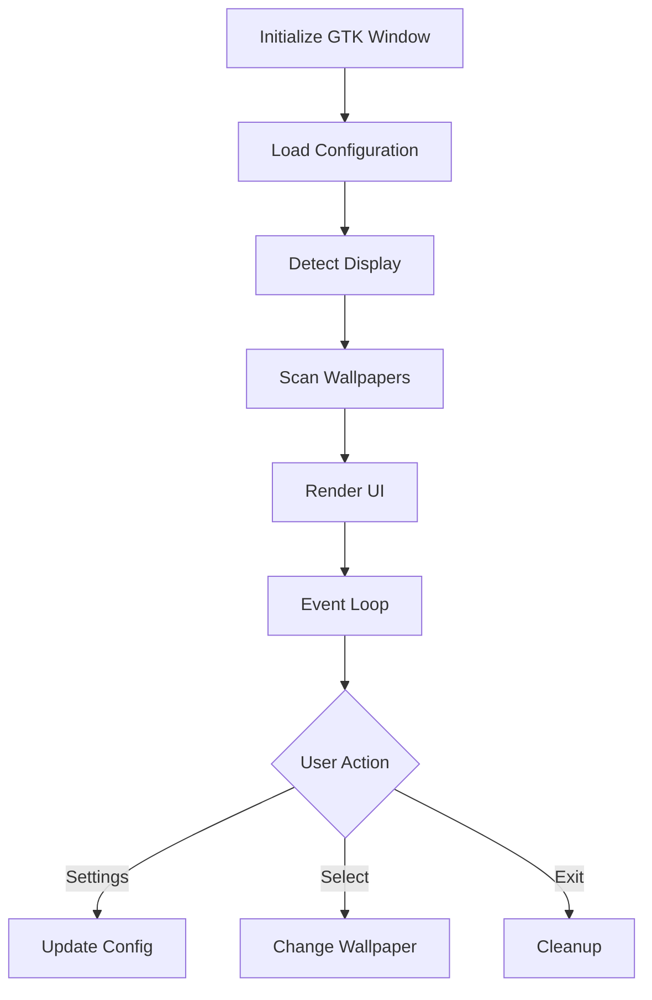

# Linux Wallpaper Engine GTK

## Machine-Optimized Implementation

This is a machine-first implementation of a GTK frontend for Linux Wallpaper Engine, designed for optimal ML processing and future automation.

### Code Philosophy

- Ultra-compact, machine-optimized code structure
- Single-source documentation via KEY comment
- Runtime debugging over human readability
- Pattern-based implementation for ML analysis
- External documentation for human transition support

### Core Components

1. **WallpaperEngine (W)**
   - Display detection and management
   - Process control and lifecycle
   - Wallpaper state handling
   - System path resolution

2. **GTK_Window (G)**
   - UI component management
   - Event handling and signals
   - State updates and rendering
   - User interaction processing

3. **SettingsDialog**
   - Configuration management
   - User preferences handling
   - Directory and path control
   - State persistence

### Operation Flow



### Variable Pattern System

Pattern | Purpose | Example
--------|---------|--------
s | self reference | `s.w=None`
p | process/parent | `s.p=next()`
w | wallpaper/window | `s.w=[p for d in[]]`
l | logger/list | `s.l=L('WE')`
d | display/directory | `s.d=next()`
c | current/command | `s.c=None`

### Operation Patterns

Pattern | Purpose | Example
--------|---------|--------
:= | check+assign | `(i:=s.e.gn())`
; | chain ops | `s.c=None;return 1`
and/or | flow control | `x and y or z`
next() | first match | `next((p for p))`
+=[x] | append | `l+=[x]`
1/0 | boolean | `'enabled':1`

### Installation

```bash
# Option 1: Python Environment
pip install -r requirements.txt

# Option 2: System Packages (Preferred)
## Ubuntu/Mint
sudo apt install python3-gi python3-gi-cairo gir1.2-gtk-3.0

## Fedora
sudo dnf install python3-gobject gtk3

## Arch Linux
sudo pacman -S python-gobject gtk3

# Requirements
- GTK 3.36+
- Python 3.8+
- linux-wallpaperengine
# Test Dependencies
pytest
pytest-cov
pytest-mock
```

### Launch

```bash

python3 linux-wallpaperengine-gtk.py

# UI Controls
← → : Navigation
🔀  : Random
⚙️  : Settings
```

### Runtime Debugging

Error patterns are handled through runtime debugging:
1. Process state validation
2. Display connection checks
3. File system access verification
4. GTK widget state management
5. Path resolution validation
6. Preview file verification
7. Permission validation
8. GTK/GDK integration checks

### Machine Learning Considerations

The codebase is optimized for:
1. Pattern recognition
2. Consistent structure
3. Predictable flow
4. Clear data paths
5. Automated refactoring

### Future Development

- Automated optimization via ML
- Pattern-based code generation
- Runtime performance analysis
- Automated debugging systems
- Self-modifying capabilities

### Testing Infrastructure

The application includes a comprehensive pytest-based testing suite:

1. **Core Engine Tests**
   - Display detection validation
   - Process management lifecycle
   - Wallpaper state handling
   - Path resolution verification

2. **Directory Manager Tests**
   - Steam library detection
   - Workshop content scanning
   - Path validation
   - Directory management

3. **UI Component Tests**
   - Window initialization
   - Settings dialog validation
   - Widget state management
   - Event handling

### Test Execution

```bash
# Run test suite
pytest linux-wallpaperengine-gtk.py -v

# Run with coverage
pytest --cov=. linux-wallpaperengine-gtk.py

# Run specific test class
pytest linux-wallpaperengine-gtk.py::TestEngine -v
```

### Test Design Principles

- Fixture-based test organization
- Full type annotations
- Comprehensive docstrings
- Mocked system interactions
- Clean test isolation
- Automated cleanup
- GTK widget lifecycle management

The test suite is designed to be:
1. Machine-readable for automated analysis
2. Pattern-consistent for ML processing
3. Self-documenting through annotations
4. Runtime-efficient through fixtures
5. Maintainable through clear structure

## License

MIT License - See LICENSE file