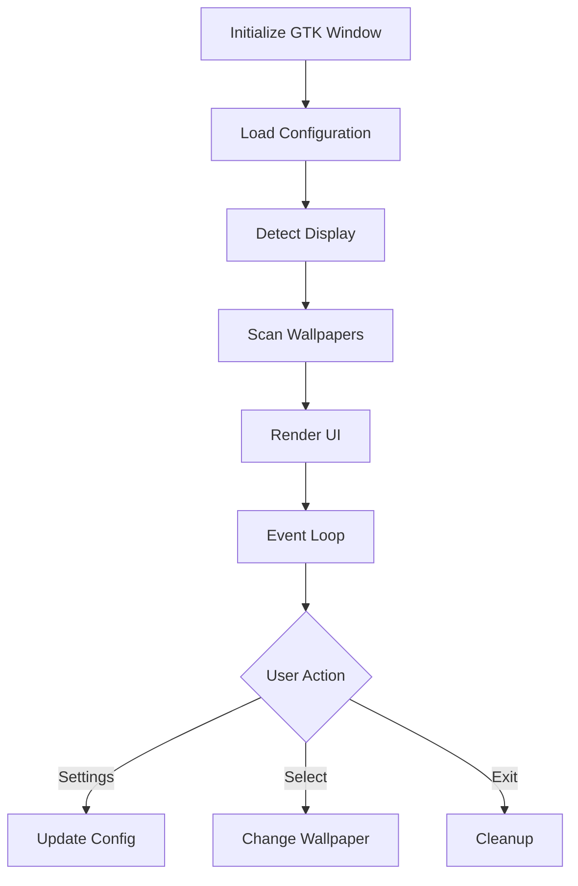

# Linux Wallpaper Engine GTK

## Machine-Optimized Implementation

This is a machine-first implementation of a GTK frontend for Linux Wallpaper Engine, designed for optimal ML processing and future automation.

### Code Philosophy

- Ultra-compact, machine-optimized code structure
- Single-source documentation via KEY comment
- Runtime debugging over human readability
- Pattern-based implementation for ML analysis
- External documentation for human transition support

### Core Components

1. **WallpaperEngine (W)**
   - Display detection and management
   - Process control and lifecycle
   - Wallpaper state handling
   - System path resolution

2. **GTK_Window (G)**
   - UI component management
   - Event handling and signals
   - State updates and rendering
   - User interaction processing

3. **SettingsDialog**
   - Configuration management
   - User preferences handling
   - Directory and path control
   - State persistence

### Operation Flow



### Variable Pattern System

Pattern | Purpose | Example
--------|---------|--------
s | self reference | `s.w=None`
p | process/parent | `s.p=next()`
w | wallpaper/window | `s.w=[p for d in[]]`
l | logger/list | `s.l=L('WE')`
d | display/directory | `s.d=next()`
c | current/command | `s.c=None`

### Operation Patterns

Pattern | Purpose | Example
--------|---------|--------
:= | check+assign | `(i:=s.e.gn())`
; | chain ops | `s.c=None;return 1`
and/or | flow control | `x and y or z`
next() | first match | `next((p for p))`
+=[x] | append | `l+=[x]`
1/0 | boolean | `'enabled':1`

### Installation

```bash
# Option 1: Python Environment
pip install -r requirements.txt

# Option 2: System Packages (Preferred)
## Ubuntu/Mint
sudo apt install python3-gi python3-gi-cairo gir1.2-gtk-3.0

## Fedora
sudo dnf install python3-gobject gtk3

## Arch Linux
sudo pacman -S python-gobject gtk3

# Requirements
- GTK 3.36+
- Python 3.8+
- linux-wallpaperengine
```

### Launch

```bash

    python3 linux-wallpaperengine-gtk.py

The application will automatically detect linux-wallpaperengine and wallpapers in common locations.

### Basic Controls

- Click any wallpaper preview to apply it
- Use toolbar buttons for:
  - Previous wallpaper (←)
  - Next wallpaper (→)
  - Random wallpaper (🔀)
  - Settings (⚙️)

### Settings

Access settings through the gear icon to configure:
- Linux Wallpaper Engine path
- Wallpaper directory
- Audio/Mouse behavior

### System Tray [WIP]

The application minimizes to system tray. Right-click the tray icon for quick actions:
- Next/Previous/Random wallpaper
- Show main window
- Exit

## Troubleshooting

### Common Issues

1. **No wallpapers showing:**
   - Check if wallpaper directory is correctly set
   - Ensure you have wallpapers downloaded from Steam Workshop
   - Verify file permissions

2. **Wallpapers not loading:**
   - Verify linux-wallpaperengine path
   - Check if linux-wallpaperengine is properly built
   - Run from terminal to see error messages

3. **Preview images not loading:**
   - Ensure wallpaper directories contain preview files
   - Check file permissions
   - Verify GTK and GDK are properly installed

### Debug Mode [WIP]

Run with debug logging enabled:

	python3 linux-wallpaperengine-gtk.py --debug

## Contributing

1. Fork the repository
2. Create a feature branch
3. Commit your changes
4. Push to your branch
5. Create a Pull Request

## License

This project is licensed under the MIT License.

## Acknowledgments

- [linux-wallpaperengine](https://github.com/Almamu/linux-wallpaperengine) for the core wallpaper engine functionality
- Steam Workshop for wallpaper content

## Related Projects

- [linux-wallpaperengine](https://github.com/Almamu/linux-wallpaperengine) - The core wallpaper engine for Linux
